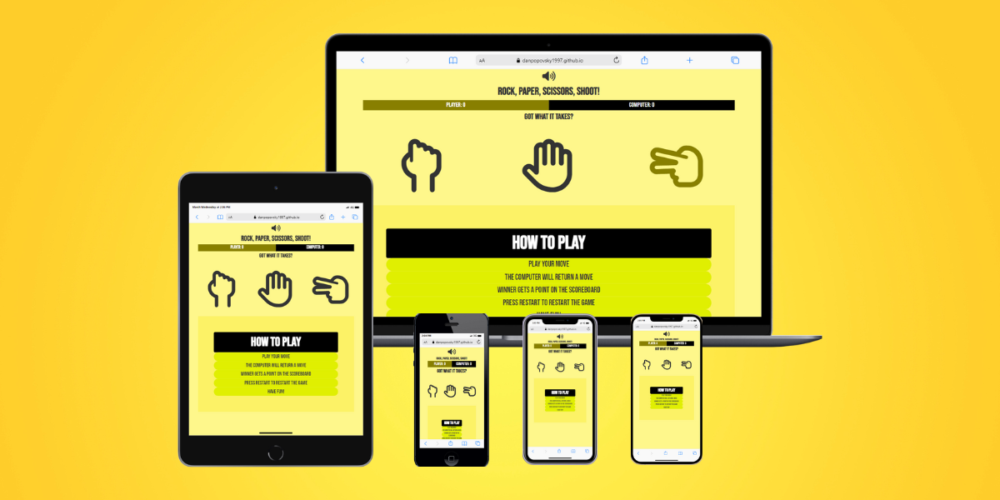
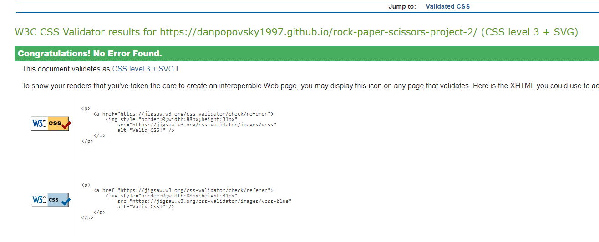

# Rock, Paper, Scissors
(Developer: Daniel Popovsky)

[Live Webpage](https://danpopovsky1997.github.io/rock-paper-scissors-project-2/)

Rock, Paper, Scissors is a game that was developed to demonstrate some of the uses of JavaScript when it comes to basic game development. This game aims to show the user how JavaScript is used to create basic functionality.

Within this game the user will be able to play against a computer, whilst being able to keep track of the overall score. Once a selection is made, the winner is decided and a point is added to the winners scoreboard. The user also has the ability to restart the game if they wish. This game has audio built into it, letting the user know if they have won, lost or if it is a draw. Background music is optional, allowing the use the mute the music using the volume button.

## Software Used
- HTML
- CSS
- JavaScript

## Features 

In this section, we will dive into some of the features and functions that are built within this game. There is a total of 10 features within the game according to JSHint.

### Existing Features

- __The Mute Button__

  - This feature is displayed at the top of the page and allows the user to turn off the background music. The user will know if the sound is on or off as the icon changes to a speaker emitting no sound. If the user clicks on it again, the background music will turn on.

- __The Restart Button__

  - This button becomes available after a move has been made, and a score is added to the scoreboard. This restart button allows the user to restart the game resetting the score. The button disappears when the game is reset.

- __The Scoreboard__

  - This scoreboard keeps track of the games score. The player's score is tracked and the computer's also. Depending on the outcome of choice, if the player wins, a point will be added to the scoreboard. Once the restart button is clicked, the score resets to 0.

- __The Selection Area__

  - This section is known as the selection area and displays the different options the user has. Each selection has a specific icon that tells the user what they are chosing. Once clicked, a winner is decided.

- __The Outcome Pop-Up__

  - This feature appears to let the user know who has won the round. The computer's choice is displayed. Depending on a win, lose or draw situation a sound will be emitted.

- __The Instructions Section__

  - This sections tells the user how to play the game.

### Features Left to Implement

- A round based system e.g. whoever gets to 10 first, wins the round.

## Testing 

In this section, we test the game using various tools. We have also tested for responsiveness to ensure it fits certain devices with a smaller screen size.

### Validation Tests

#### HTML Validation

To validate my HTML I used The Nu HTML Checker (W3C). This tool ensures any errors, warnings or mistakes are detected before release. The HTML check ran unsuccessfully at first. This allowed me make a few changes and re-run the check, this time being successful.

HTML Check

#### CSS Validation
To validate my CSS I used The W3C Jigsaw CSS Validation Service. This ensures any warnings or errors are found. I ran the validation service for my web page and it passed without any errors.

CSS Validation for Web Page

  
  
#### JavaScript Validation
To validate my JavaScript I used JSHint. I ran the tests and had a few syntax issues. I fixed these and re-ran the test again and had to errors relating to the code. There were however a few warnings, but nothing that impacted the functionality of the code itself.

JavaScript Code Validation

    
  
### Performance
To measure performance I used Google's Lighthouse tool in Chrome Developer Tools. This was to ensure all pages met a high standard of performance across different devices. Tests showed a high score on two devices, desktop and mobile

Lighthouse - Desktop

  

Lighthouse - Mobile

  

### Responsiveness for screen sizes was tested on the following devices:

1. iPhone 5

  

2. iPhone 11

  

3. iPhone 12 Pro

  

4. iPad Air

  

5. MacBook
>
  

### Browser Compatibility

I tested the website on the following web browsers to ensure consistency and responisveness:
- Google Chrome
- Edge
- Opera
- Mozilla Firefox

### Errors

There seems to be a policy in place that does not allow autoplay files to be played. This has led to the background music not being able to play. However, when launching a Live Server from VS Code the background music does play. I was unsure on how I was to go about this problem and issue. I have attached a picture of the error from Chrome Developer Tools and a link to the policy itself. 

Error

## Deployment 

This site was deployed using GitHub pages. To deploy a page, here are the steps to take:
- Go to the GitHub repository and navigate to the settings tab
- From the source section drop-down menu, click on the master branch
- Once the master branch has been selected, the page will refresh and a detailed ribbon will appear to indicate that the page has been deployed successfully.

The live link can be found here - https://danpopovsky1997.github.io/rock-paper-scissors-project-2/

## Credits

### Content

I would like to thank:
1. Traversy Media for providing a detailed tutorial on how to develop the game. It gave me an insight into how to create such game and add functionality to the game. This tutorial helped me create a foundation for my project. Link: https://www.youtube.com/watch?v=WR_pWXJZiRY
2. Code Institute Solutions for providing a ReadMe template. Link: https://github.com/Code-Institute-Solutions/readme-love-maths/edit/master/README.md
3. Gaming Sounds for providing the Mario Sound Effect. Link: https://www.youtube.com/watch?v=fWNvyXUsc1c
4. Doggity for providing the Lose Effect. Link: https://www.youtube.com/watch?v=An807vCU6kQ
5. Brawl Stars - Sound Effects for providing the Win Effect. Link: https://www.youtube.com/watch?v=f2X0UxX8YrA
6. Cash Art2 for providing the Draw Effect. Link: https://www.youtube.com/watch?v=6AaKkGrTqjE
7. Children's City for providing the Background Music. Link: https://www.youtube.com/watch?v=FOK_7c-YNwc
8. FontAwesome for providing the icons used in the project.

